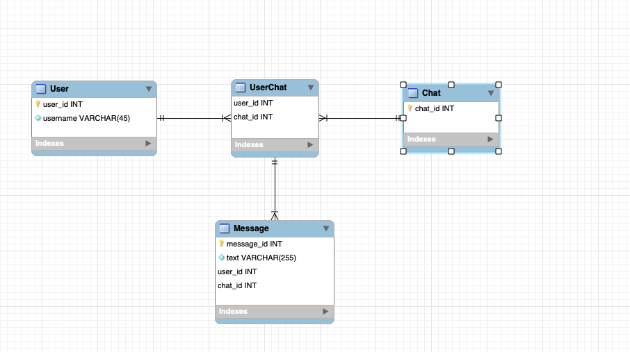

# Week 6 - Project - Chat API

In this project, we have to create an API that serves as backend for a chat service. This chat service is composed of Users, Chats and Messages.

We will need to fill the database first, so the API can get the info requested (We can also add information to the database through the API)

- MySQLWorkbench:

First things first, we need to create a basic diagram that connects all the components of the database. There will be Chats (PK chat_id), Users (PK user_id, username as a varchar) and Messages (PK message_id, text of the message as a varchar, FK user_id and FK chat_id as each message needs to be sent by a specific user in a specific chat). Also, as the relation between Users and Chats is N:N, we need to create an intermediate table UserChat that will contain each PK (user_id and chat_id) as Foreign Keys within the table UserChat.

Once we have created the tables, we will need to connect the database from VS Code by using "mysqlconn.connect". We, then, can start defining the functions that we will use to fill each of these tables (create_user, create_chat, add_user_to_chat and add_message_to_chat). 

We have also been asked in this project to create queries to get all the messages within a chat and to analyze the sentiment of each message using the NLTK module. We have also defined functions for each of these queries in the "sql.py" file.

- API:

Once we have the database created together with the functions, we need to connect the API with this database so we can request/get or insert information on it. This process is done in the "endpoints.py" file.

We do this through the Flask module which is a framework that allows us to fetch data from a server. We need to first run the app (main.py) and then we can ask for information (GET) such as getting all the messages from a chat, or we can also add information into the database (POST) such as creating a new user, creating a new chat, adding a new user into an existing chat, etc.
